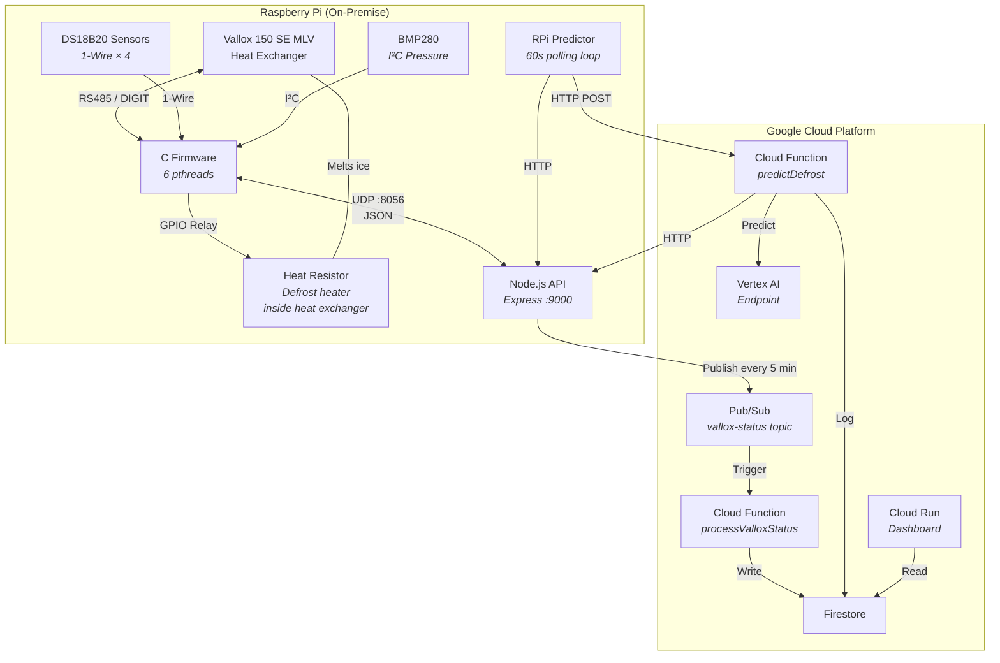
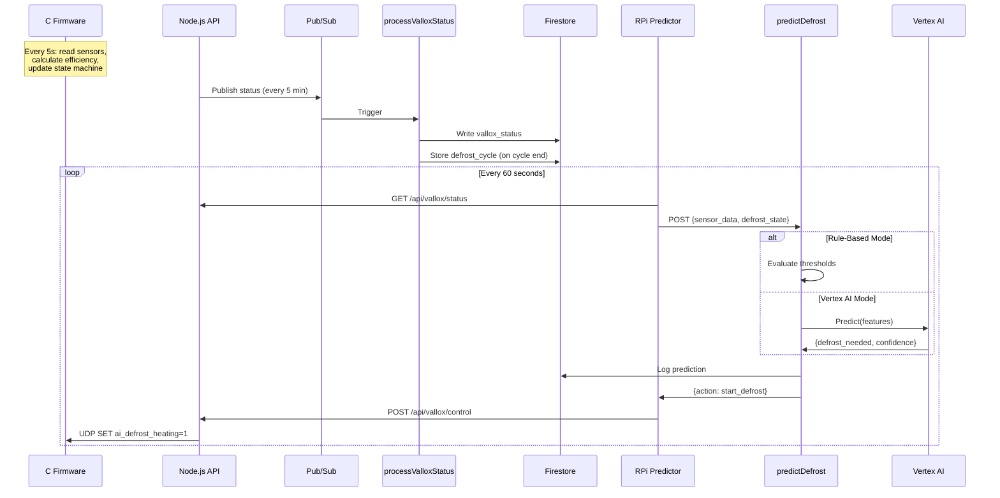
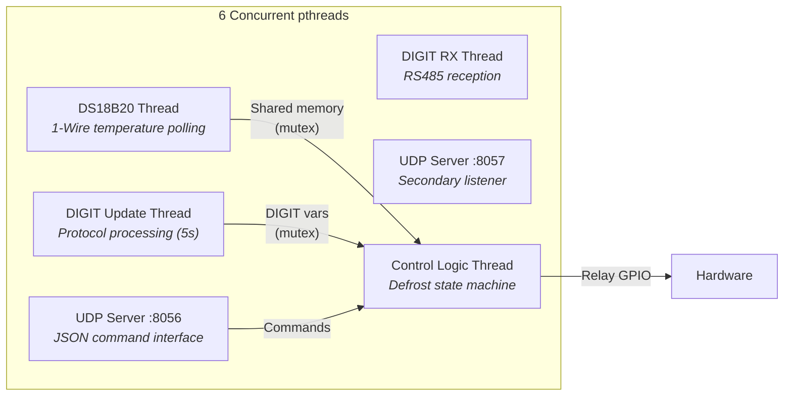
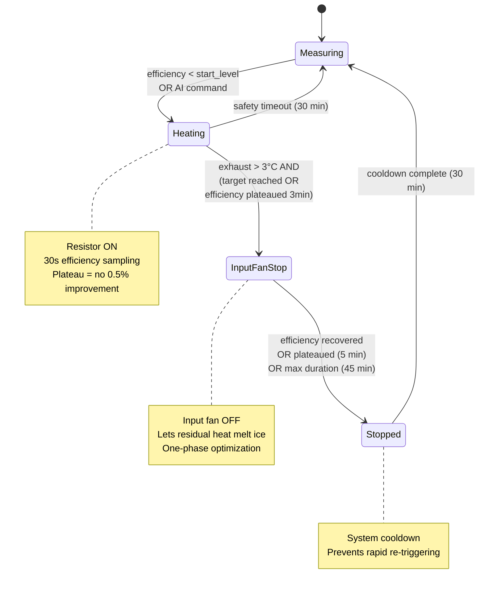
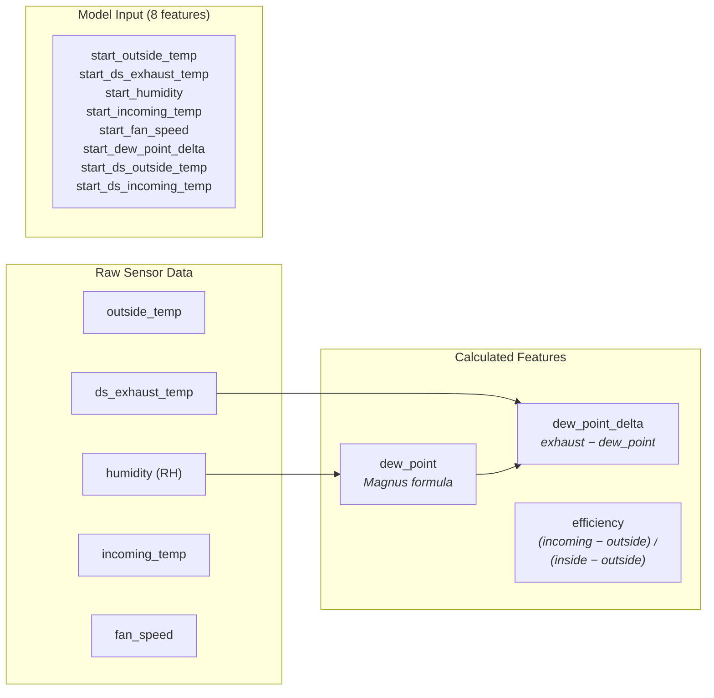
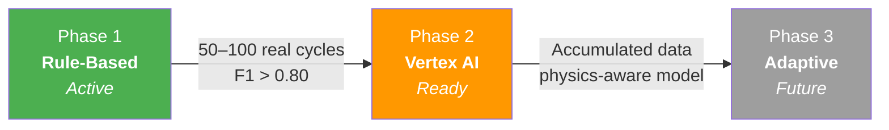
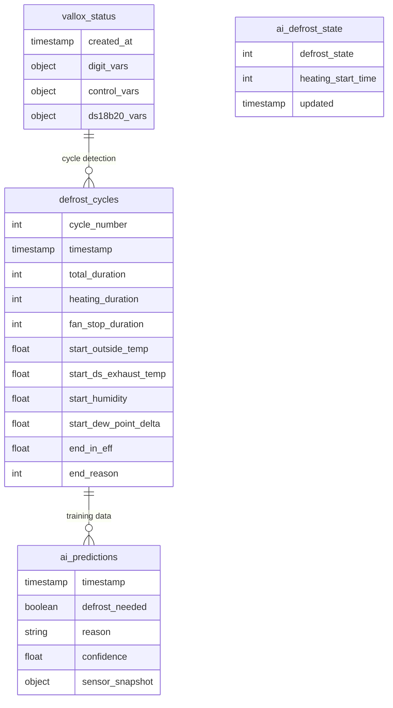

# Vallox Control — IoT Home Automation with AI-Powered Defrost

> Full-stack IoT system for monitoring and controlling a **Vallox 150 SE MLV** heat-recovery ventilation unit.  
> Combines **embedded C firmware**, a **Node.js gateway API**, **GCP Cloud Functions**, a **Next.js dashboard**, and a **Python ML pipeline** — all working together to replace the manufacturer's defrost logic with an AI-driven alternative.

---

## Why This Project Exists

Finnish winters routinely drop below −20 °C. At these temperatures, moisture in the exhaust air freezes inside the counter-flow heat exchanger, blocking airflow and destroying efficiency. The factory defrost algorithm is crude — fixed timers and simple thresholds — wasting energy and sometimes failing entirely during extreme cold or sauna use.

This project replaces that logic with a physics-aware, data-driven system that:
- **Monitors** the unit in real-time via custom sensors (DS18B20, BMP280) and the proprietary DIGIT protocol
- **Controls** defrost heating and fan-stop cycles through a multi-phase state machine
- **Learns** optimal defrost timing from accumulated cycle data using Gradient Boosting models on Vertex AI
- **Visualizes** everything through a responsive Next.js dashboard deployed on Cloud Run

---

## Tech Stack

| Layer | Technology | Purpose |
|---|---|---|
| **Embedded Firmware** | C (POSIX pthreads, bcm2835) | 6-thread real-time control on Raspberry Pi |
| **Hardware Sensors** | DS18B20 (1-Wire), BMP280 (I²C), RS485 | Temperature, pressure, humidity, DIGIT protocol |
| **Gateway API** | Node.js / Express / TypeScript | REST API + UDP bridge + GCP Pub/Sub publisher |
| **Cloud Functions** | TypeScript (GCP Gen2) | Event-driven status logging & AI defrost controller |
| **ML Pipeline** | Python / scikit-learn / Vertex AI | Gradient Boosting defrost prediction models |
| **Dashboard** | Next.js 16 / React 19 / MUI 7 / Recharts | Real-time monitoring UI on Cloud Run |
| **Infrastructure** | GCP (Pub/Sub, Firestore, Cloud Run, Vertex AI) | Serverless event processing & model serving |
| **Data Validation** | Zod 4 | Runtime schema validation across API boundaries |
| **Auth** | NextAuth.js + bcrypt | Dashboard access control |

---

## System Architecture



---

## Data Flow — Defrost Cycle

The complete lifecycle of an AI-controlled defrost cycle, from sensor reading to actuator command:



---

## Embedded Firmware (C)

The firmware runs on a Raspberry Pi as a multi-threaded POSIX application:

### Threading Model



### Defrost State Machine

The firmware implements a 4-state defrost controller with improvement-based stopping logic:



### Key Design Decisions

- **Safety-first**: Local 30-minute heating timeout operates independently of cloud — the device never depends on network connectivity for safety
- **Improvement-based stopping**: Instead of fixed thresholds, the firmware samples efficiency every 30 seconds and detects plateaus (< 0.5% improvement over configurable windows)
- **Dual sensor validation**: Both DIGIT protocol NTC and DS18B20 sensors must agree before state transitions
- **Persistent cycle counter**: Stored to filesystem, survives reboots

### Source Structure

```
c/
├── main.c                    # Entry point, pthread creation
├── ctrl_logic.c/h            # Defrost state machine (1258 lines)
├── digit_protocol.c/h        # Vallox DIGIT protocol (RS485)
├── rs485.c/h                 # Serial communication layer
├── DS18B20.c/h               # 1-Wire temperature sensors
├── defrost_resistor.c/h      # Heating element control
├── pre_heating_resistor.c/h  # Pre-heating management
├── post_heating_counter.c/h  # Post-heating logic
├── relay_control.c/h         # GPIO relay switching (bcm2835)
├── udp-server.c/h            # UDP JSON command interface
├── json_codecs.c/h           # JSON encoding/decoding
├── jsmn.c/h                  # Minimal JSON parser (tokenizer)
├── temperature_conversion.c/h # NTC thermistor conversion
└── Makefile                  # Builds with -lpthread -lbcm2835
```

---

## Node.js Gateway API

TypeScript Express server bridging the firmware with GCP cloud services.

### Responsibilities
- **UDP ↔ REST bridge**: Translates HTTP requests to UDP JSON messages for the firmware
- **Pub/Sub publisher**: Aggregates sensor data and publishes to GCP every 5 minutes
- **Control endpoint**: Accepts commands from the RPi Predictor and forwards to firmware

### API Endpoints

```
GET  /api/vallox/status?type={digit_vars|control_vars|ds18b20_vars}
POST /api/vallox/control  { type, variable, value }
```

### Key Files

```
vallox-control-api/
├── src/
│   ├── index.ts              # Express server + publisher init
│   ├── config.ts             # Environment config (PORT, UDP, Pub/Sub)
│   ├── routes/               # REST route handlers
│   ├── services/
│   │   ├── pubsub.ts         # GCP Pub/Sub client
│   │   └── status-publisher.ts  # 5-min aggregation loop
│   └── vallox/               # UDP communication layer
└── tsconfig.json
```

---

## Cloud Functions (GCP Gen2)

### `processValloxStatus` — Event-Driven Data Pipeline

Triggered by Pub/Sub messages. Performs two tasks:
1. **Status archival** → Writes sensor snapshots to `vallox_status` collection
2. **Cycle detection** → Compares `defrost_cycle_count` against stored metadata to detect completed cycles and archives full cycle data to `defrost_cycles` collection

### `predictDefrost` — AI Defrost Controller

HTTP-triggered function called every 60 seconds by the RPi Predictor. Supports two modes:

| Mode | Config | Description |
|---|---|---|
| **Rule-Based** | `PREDICTION_MODE=rules` | Physics-based thresholds matching firmware logic |
| **Vertex AI** | `PREDICTION_MODE=vertex_ai` | ML model inference via Vertex AI endpoint |

**Safety guardrails** are enforced regardless of prediction mode:
- Minimum 30-minute cooldown between cycles
- Efficiency floor checks before triggering
- Fireplace mode override (prevents defrost during fireplace operation)

---

## ML Pipeline (Python)

Gradient Boosting models trained on physics-based features from real defrost cycles:

### Feature Engineering



The **dew point delta** is the single most important predictor — when `exhaust_temp − dew_point < 0`, water vapor is guaranteed to condense on heat exchanger surfaces.

### Models

| Model | Algorithm | Target | Readiness |
|---|---|---|---|
| **Classifier** | GradientBoostingClassifier (100 trees, depth 5) | Defrost success (binary) | F1 > 0.80 on real data |
| **Regressor** | GradientBoostingRegressor (100 trees, depth 5) | Optimal duration (seconds) | RMSE < 60s on real data |

### Pipeline Files

```
python/
├── ai_learner.py       # Training pipeline → Vertex AI deployment
├── train_model.py      # CLI training entry point
├── simulate_data.py    # Synthetic data generator (3 scenarios)
├── ai_config.py        # Feature definitions, GCP config
├── BMP280.py           # Pressure sensor interface
└── requirements.txt    # scikit-learn, google-cloud-aiplatform
```

### AI Evolution



---

## Dashboard (Next.js 16)

Real-time monitoring UI deployed on **Cloud Run**.

### Tech
- **Next.js 16** with App Router and Server Components
- **React 19** + **MUI 7** component library
- **Recharts** for temperature/efficiency charts
- **Zod 4** for runtime data validation
- **NextAuth.js** for session management

### Components

| Component | Purpose |
|---|---|
| `ControlPanel` | Main dashboard with live sensor readings |
| `DefrostStatus` | Current defrost state, AI metrics, cycle history |
| `DefrostConfigPanel` | Tunable parameters (thresholds, durations) |
| `TemperatureChart` | Real-time temperature trend visualization |
| `EfficiencyStats` | Heat recovery efficiency monitoring |
| `FireplaceControl` | Fireplace mode toggle with timer |
| `FanControl` | Fan speed adjustment |
| `AiSettings` | AI mode configuration |

### Data Flow

```
Firestore (vallox_status, defrost_cycles)
    ↓ Server Components (direct Firestore reads)
Dashboard UI
    ↓ Server Actions
Node.js API → C Firmware (control commands)
```

---

## Firestore Schema



---

## Deployment

### Infrastructure

| Service | Platform | Trigger |
|---|---|---|
| C Firmware | Raspberry Pi (systemd) | Boot |
| Node.js API | Raspberry Pi (pm2) | Boot |
| RPi Predictor | Raspberry Pi (pm2) | Boot |
| processValloxStatus | Cloud Functions Gen2 | Pub/Sub |
| predictDefrost | Cloud Functions Gen2 | HTTP |
| Dashboard | Cloud Run | HTTPS |
| ML Models | Vertex AI Endpoint | HTTP |

### Quick Start

```bash
# Build C firmware
cd c/ && make

# Run Node.js API
cd vallox-control-api/ && npm install && npm start

# Train ML model
cd python/
pip install -r requirements.txt
python simulate_data.py          # Generate synthetic data
python train_model.py --deploy   # Train & deploy to Vertex AI

# Deploy cloud functions
./deploy_predict.sh              # AI defrost controller
./deploy_training.sh             # Model training function

# Run dashboard locally
cd dashboard/ && npm install && npm run dev
```

### GCP Configuration

```
Project:  pekan-vallox-control
Region:   europe-north1
```

| Environment Variable | Purpose |
|---|---|
| `PREDICTION_MODE` | `rules` or `vertex_ai` |
| `VERTEX_ENDPOINT_ID` | Vertex AI model endpoint |
| `VALLOX_API_URL` | RPi API address |
| `VALLOX_API_TOKEN` | API authentication |

---

## Repository Structure

```
vallox_control/
├── c/                          # Embedded C firmware (Raspberry Pi)
├── vallox-control-api/         # Node.js Express gateway API
├── cloud-functions/            # GCP: status logging (Pub/Sub trigger)
├── cloud-functions-predict/    # GCP: AI defrost controller (HTTP)
├── cloud-functions-training/   # GCP: model training pipeline
├── python/                     # ML training scripts & data simulator
├── rpi-predictor/              # On-device AI orchestrator (60s loop)
├── dashboard/                  # Next.js 16 monitoring UI
├── BMP280_driver/              # Bosch pressure sensor driver
├── deploy_predict.sh           # Cloud Function deployment script
├── deploy_training.sh          # Training function deployment script
├── DEFROST_IMPROVEMENT_PLAN.md # Detailed firmware improvement spec
└── CLAUDE.md                   # Developer reference & architecture
```

---

## License

Private project — not open source.
