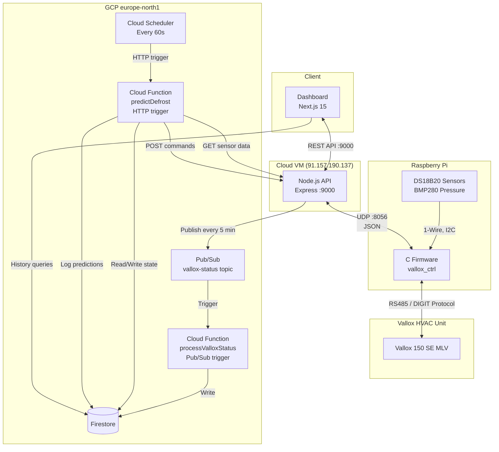
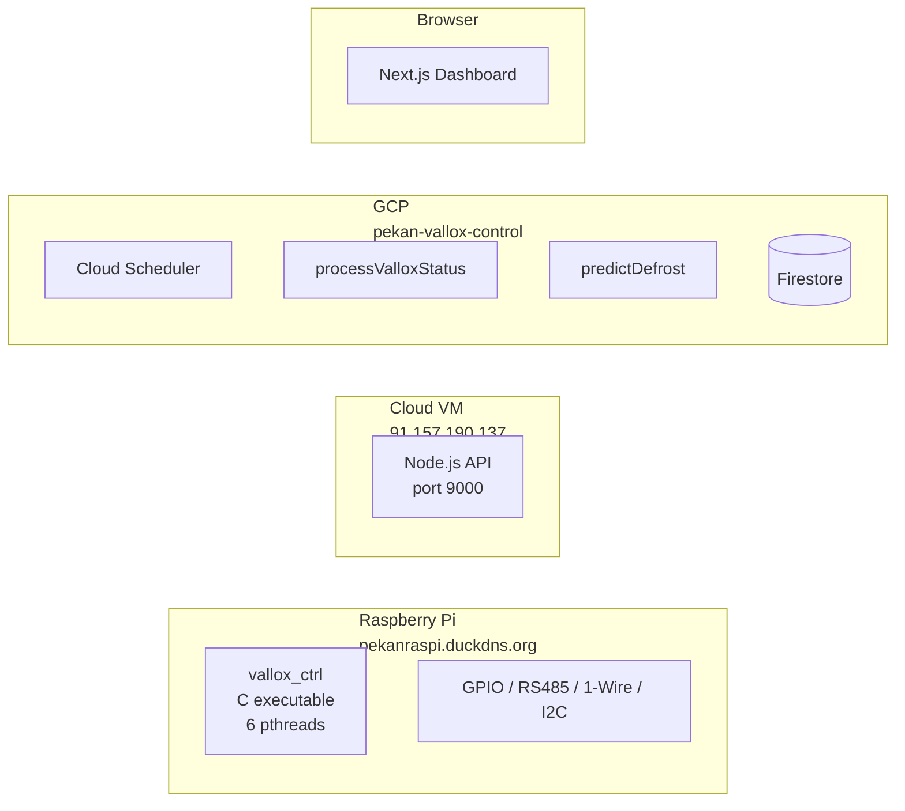
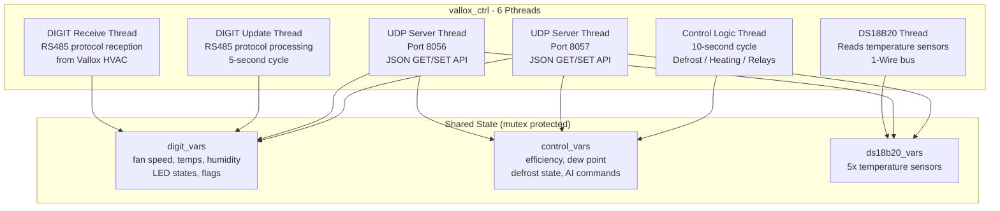
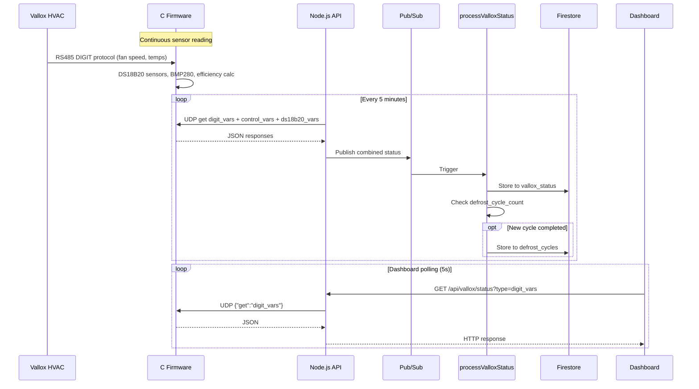
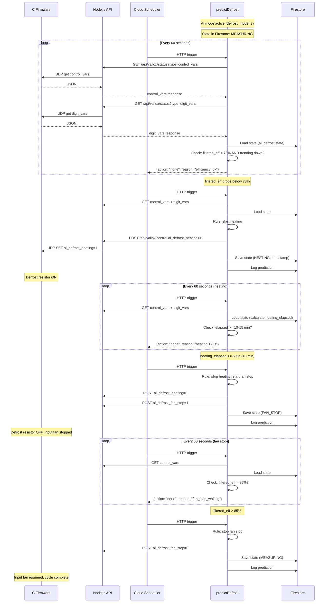
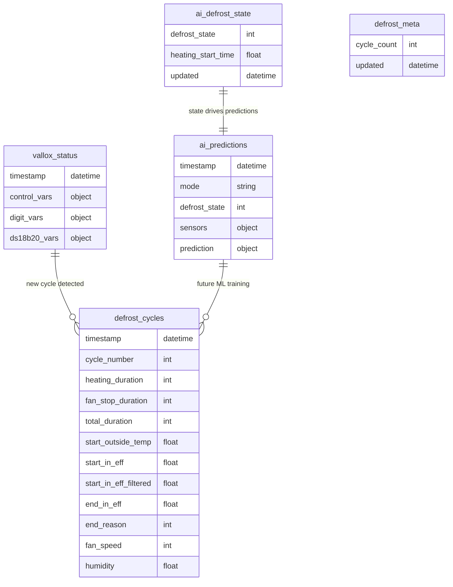
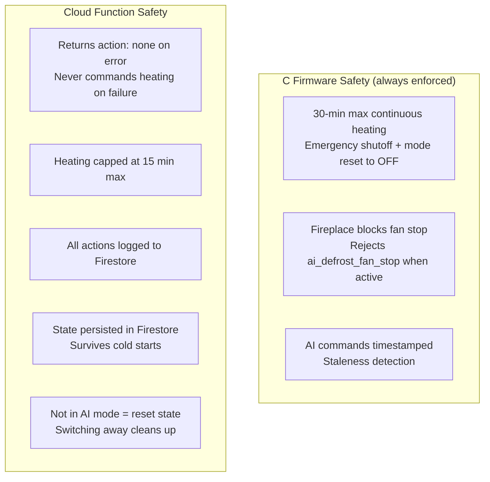
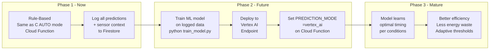

# Vallox Control System - Complete Architecture

## System Overview



## Deployment Map



## C Firmware Threading Model



## Data Flow - Normal Operation



## Data Flow - AI Defrost Cycle

The Cloud Function (`predictDefrost`) is fully self-contained. It fetches sensor data from the Node.js API, runs the defrost algorithm, sends commands back through the API, and persists its state in Firestore.



## Defrost Modes

```mermaid
stateDiagram-v2
    [*] --> OFF: defrost_mode=0
    [*] --> ON: defrost_mode=1
    [*] --> AUTO: defrost_mode=2
    [*] --> AI: defrost_mode=3

    state OFF {
        [*] --> HeatingDisabled
    }

    state ON {
        [*] --> HeatingAlwaysOn
    }

    state AUTO {
        [*] --> Measuring_A
        Measuring_A --> Heating_A: filtered_eff < 73%<br>AND raw < filtered
        Heating_A --> FanStop_A: 10-15 min elapsed
        Heating_A --> FanStop_A: eff > 85% (early)
        FanStop_A --> Stopped_A: filtered_eff > 85%
        Stopped_A --> Measuring_A: 10 min cooldown
        note right of AUTO: All logic runs in<br>C firmware locally
    }

    state AI {
        [*] --> Measuring_AI
        Measuring_AI --> Heating_AI: Cloud Function:<br>start_heating
        Heating_AI --> FanStop_AI: Cloud Function:<br>stop_heating_start_fan_stop
        FanStop_AI --> Measuring_AI: Cloud Function:<br>stop_fan_stop
        note right of AI: Same rules as AUTO<br>but runs in cloud.<br>Tunable + logged.
    }
```

## Firestore Collections



## Port and Protocol Reference

| Port  | Protocol     | From                        | To          | Purpose                   |
| ----- | ------------ | --------------------------- | ----------- | ------------------------- |
| RS485 | DIGIT serial | Pi GPIO                     | Vallox HVAC | Fan speed, temps, control |
| 8056  | UDP JSON     | Node.js API                 | C Firmware  | GET/SET variables         |
| 8057  | UDP JSON     | (secondary)                 | C Firmware  | GET/SET variables         |
| 9000  | HTTP REST    | Dashboard / Cloud Functions | Node.js API | Status + control          |
| 3005  | WebSocket    | Legacy web app              | WS bridge   | Real-time updates         |

## Safety Mechanisms



## AI Evolution Path



## Setup Steps

### 1. Deploy the Prediction Cloud Function

```bash
cd cloud-functions-predict/
npm install

# Set your API token
export VALLOX_API_TOKEN=<your-token>
npm run deploy
```

### 2. Set Up Cloud Scheduler

Create a Cloud Scheduler job to trigger the Cloud Function every 60 seconds:

```bash
gcloud scheduler jobs create http predictDefrost-trigger \
    --location=europe-north1 \
    --schedule="* * * * *" \
    --uri="https://europe-north1-pekan-vallox-control.cloudfunctions.net/predictDefrost" \
    --http-method=POST \
    --attempt-deadline=30s \
    --time-zone="Europe/Helsinki"
```

### 3. Enable AI Mode

Via Dashboard: Set defrost mode to "AI" in DefrostModeControl.

Or via API:

```bash
curl "http://<api-ip>:9000/api/vallox/control?token=<token>" \
    -X POST -H "Content-Type: application/json" \
    -d '{"type":"control_vars","variable":"defrost_mode","value":3}'
```

### What Happens When You Click "Defrost Mode AI"?

1.  **Firmware Switch**: The C firmware running on the device switches `defrost_mode` to `3` (AI).
2.  **Passive Control**: The internal automatic defrost logic (AUTO mode) is **disabled**. The firmware stops making its own decisions about when to run the defrost resistors or stop fans.

### What about Vertex Generative AI Studio?

You asked if you can use **Generative AI Studio**.

- **Current Project (Predictive AI)**: This project uses **Predictive AI** (Scikit-Learn). It takes numbers (temperature, efficiency) and predicts numbers (probability of frost). This is the standard industrial approach for control systems.
- **Generative AI (GenAI)**: Vertex AI Studio is for _Generative_ models (like Gemini) that create text, images, or code.

**How could GenAI help here?**
While GenAI won't directly control the fans (it's too slow and hallucination-prone for sub-second safety decisions), it _can_ be used for:

1.  **Explaining Events**: You could feed the logs to Gemini to get a summary: _"The unit defrosted 5 times last night because humidity spiked at 3 AM."_
2.  **Dashboard Chat**: A chatbot in your dashboard to ask _"Is the unit running efficiently?"_
3.  **Code Generation**: Writing these scripts! (As we are doing now).

For the core defrost control logic, **AutoML Tabular** or custom **Predictive Models** (what we are building) are the correct tools.

### How do I know the AI Model is "Ready"?

The system is currently in **Phase 1 (Learning)**. To move to **Phase 2 (Active AI Control)**, look for these signs in the training output:

1.  **Data Volume**: You have at least **50-100 real cycles**. (Currently we are using synthetic data).
2.  **Accuracy**:
    - **Classification**: F1 Score > **0.80**. (Means it reliably predicts success vs failure).
    - **Regression**: RMSE represents the error in seconds. Lower is better (e.g., < 60s error).
3.  **Feature Sense**:
    - Look at the "Top 3 Predictive Features" printed by the script.
    - **Good**: `in_efficiency_filtered`, `outside_temp`, `humidity` (Physical causes).
    - **Bad**: Random noise or irrelevant variables.

Once these criteria are met, we can update the `predictDefrost` cloud function to load the trained model instead of using the hardcoded rules. 3. **Command Listening**: The firmware enters a "listening" state, waiting for explicit commands: - `ai_defrost_heating` (1 = ON, 0 = OFF) - `ai_defrost_fan_stop` (1 = ON, 0 = OFF) 4. **Cloud Control Loop**: - The `predictDefrost` Cloud Function runs every 60 seconds. - It checks the sensor data (efficiency, temperatures). - **If needed**, it sends API requests to toggle the variables above.
_ **Phase 1 (Current)**: It uses the same logic as AUTO mode but runs in the cloud (Rule-Based). This verifies the data pipeline.
_ **Phase 2 (ML)**: Once trained, it will use the Python-trained model to predict optimal defrost cycles. \* **Phase 3 (Physics-Aware)**: The model learns complex relationships, such as the "Dew Point vs Exhaust Temp" rule (if dew point < exhaust temp -> severe icing risk), ensuring deeper understanding than simple threshold logic.

> **Note**: If the Cloud Scheduler or Cloud Function stops running while in AI Mode, the unit will **NOT** defrost automatically. The C firmware has safety timeouts (e.g., max heating duration) but will not _start_ a cycle on its own.

### 4. Monitor

Cloud Function logs:

```bash
gcloud functions logs read predictDefrost --region=europe-north1
```

Firestore: check `ai_predictions` and `ai_defrost/state` collections.

## Configuring Thresholds

Edit `cloud-functions-predict/src/index.ts`:

```typescript
const DEFROST_START_LEVEL = 73; // Start heating below this filtered eff (%)
const DEFROST_TARGET_IN_EFF = 85; // Fan stop ends above this filtered eff (%)
const DEFROST_HEATING_MIN = 10 * 60; // Min heating (seconds)
const DEFROST_HEATING_MAX = 15 * 60; // Max heating (seconds)
```

Redeploy: `cd cloud-functions-predict && npm run deploy`

## File Reference

| File                                                  | Runs on  | Purpose                                          |
| ----------------------------------------------------- | -------- | ------------------------------------------------ |
| `c/main.c`                                            | Pi       | Firmware entry point, 6 threads                  |
| `c/ctrl_logic.c`                                      | Pi       | Defrost state machine (AUTO + AI modes)          |
| `c/digit_protocol.c`                                  | Pi       | RS485 DIGIT communication                        |
| `c/udp-server.c`                                      | Pi       | UDP JSON API (ports 8056/8057)                   |
| `vallox-control-api/src/routes/vallox.ts`             | Cloud VM | REST API endpoints                               |
| `vallox-control-api/src/services/status-publisher.ts` | Cloud VM | Pub/Sub publisher (5 min interval)               |
| `cloud-functions/src/index.ts`                        | GCP      | Pub/Sub processor, Firestore writer              |
| `cloud-functions-predict/src/index.ts`                | GCP      | AI defrost controller (rules + future Vertex AI) |
| `dashboard/`                                          | Hosted   | Next.js 15 dashboard UI                          |
| `python/train_model.py`                               | Dev      | ML training pipeline (Phase 2)                   |
| `python/ai_learner.py`                                | Dev      | Training data prep + model training              |
| `python/ai_config.py`                                 | Dev      | Shared ML config (Phase 2)                       |
